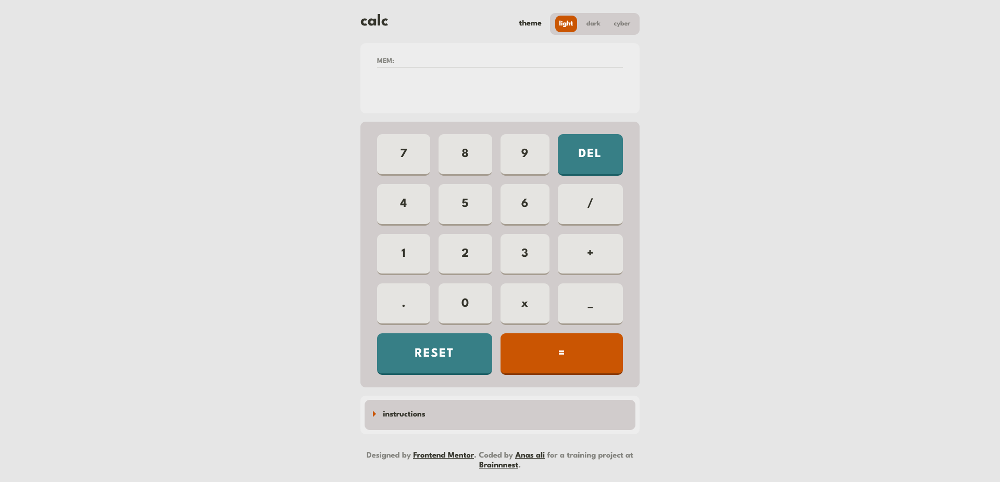

# Frontend Mentor - Calculator app solution

This is a solution to the [Calculator app challenge on Frontend Mentor](https://www.frontendmentor.io/challenges/calculator-app-9lteq5N29). Frontend Mentor challenges help you improve your coding skills by building realistic projects. 

## Table of contents

- [Overview](#overview)
  - [The challenge](#the-challenge)
  - [Screenshot](#screenshot)
  - [Links](#links)
- [My process](#my-process)
  - [Built with](#built-with)
  - [Features](#features)
  - [What I learned](#what-i-learned)
  - [Useful resources](#useful-resources)
- [Author](#author)


## Overview

### The challenge

Users should be able to:

- See the size of the elements adjust based on their device's screen size
- Perform mathmatical operations like addition, subtraction, multiplication, and division
- Adjust the color theme based on their preference
- **Bonus**: Have their initial theme preference checked using `prefers-color-scheme` and have any additional changes saved in the browser

### Screenshot



### Links

- Solution URL: [https://github.com/anas-cd/brainnest-w4-mainpr](https://github.com/anas-cd/brainnest-w4-mainpr)
- Live Site URL: [https://anas-cd.github.io/brainnest-w4-mainpr/](https://anas-cd.github.io/brainnest-w4-mainpr/)

## My process

### Built with

- Semantic HTML5 markup
- CSS custom properties
- Flexbox
- CSS Grid
- Javascript

### Features

- Basic math ops -> add, subtract, multiply, divide
- Memory display
- Reset and Delete keys
- User can chain several operations one after another
- Responsive design 
- Smart theme switching (detects system theme preference, also saves chosen theme for next visit)
- Keyboard support
- Ability to use negative numbers
- Shows dynamic error and confirmation messages
- Users can copy results to clipboard and past numbers to calculator screen
- Dynamic number notation and text size depending on screen width


### What I learned

A really nice way to show messages like errors and confirmation messages is to create a pre-styled element using JS and clone this element and prepend it to the specific messages container. 

for example;

```css
.err-message {
  color: red;
}
.conf-message {
  color: green;
}
```
```js
const errDisplay = document.querySelector('#msgContainer');
const p = document.createElement('p');

export function showError(errMsg) {
    // makes a clone of the error showing element then populates it with the error message and display if for 4 seconds 
    let currentErrorNode = p.cloneNode(false);
    currentErrorNode.textContent = errMsg;
    errDisplay.prepend(currentErrorNode);
    currentErrorNode.classList.add('err-message');
    setTimeout(() => {
       currentErrorNode.remove();
    }, 4000 );
}
```

### Useful resources

- [DOM Node interface](https://developer.mozilla.org/en-US/docs/Web/API/Node) - This helped me to understand how to create, change or remove an element.

## Author

- Website - [Anas](https://dev.anasali.info/)
- Frontend Mentor - [@anas-cd](https://www.frontendmentor.io/profile/anas-cd)
